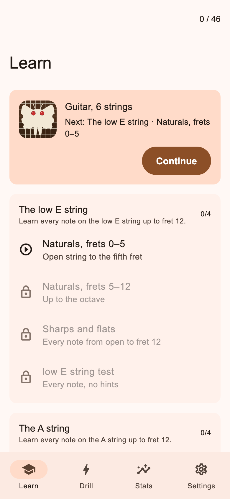
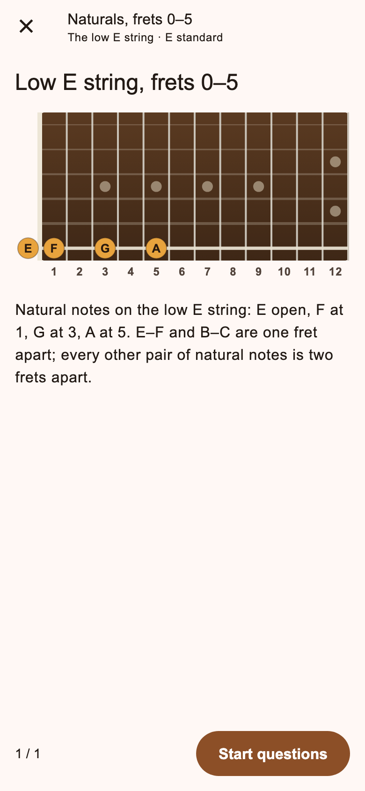
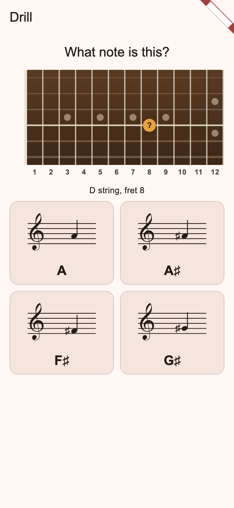
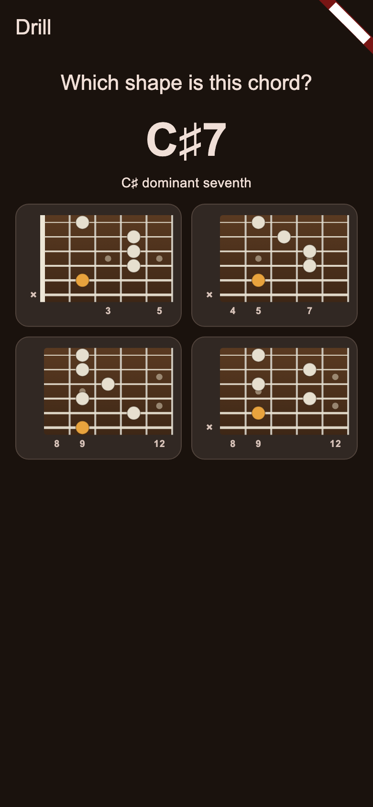

# Fretboard Trainer
### An interactive guitar and bass fretboard training tool

**Fretboard Trainer** is an Android and iOS app for learning the fretboard of
guitars and basses through quick drills. It starts with single-note
recognition in standard tuning, then non-standard tunings (drop D, C standard,
…), and goes on to chords: open, power and barre.

See [PLAN.md](PLAN.md) for the design and status, and
[CHANGELOG.md](CHANGELOG.md) for what changed in each version.

## Download

Ready-made builds are on the
[Releases page](https://github.com/drlholloway/fretboardtrainer/releases):

| Platform | File | Notes |
|---|---|---|
| Android | `fretboardtrainer-android-<version>.apk` | Open the APK on the phone; allow installs from the browser once. |
| macOS | `fretboardtrainer-macos-<version>.zip` | Not notarized: on first launch use System Settings → Privacy & Security → **Open Anyway**. |
| iOS | TestFlight / App Store | Not on the Releases page. |

| Learn path | Teach card | Fret → Note | Name → Chord |
|---|---|---|---|
|  |  |  |  |

## Modes of use

### Note and chord identification (Drill)

Free practice with four question types, any mix:

- **Fret → Note**: a fretboard with one fretted position; pick the note from
  four choices shown on the staff and by name.
- **Note → Fret**: a note on the staff; pick which of four marked positions
  sounds it.
- **Chord → Name**: a chord shape; pick its name.
- **Name → Chord**: a chord name; pick its shape.

Options: fret range, natural notes only, which strings, which chord families
(open, power, barre), and 10 / 20 / 50 / endless questions.

### Learning the fretboard walk-through (Learn)

A Duolingo-style path. It starts with guitar in E standard and teaches the
notes on the low E string, then A, D, G, B and high E, with a test at the end
of each string. Then the whole fretboard mixed, open chords, power chords,
barre chords, and finally drop D (the lowest string retuned, plus one-finger
power chords). Bass follows the same path without open and barre chords.
Lessons unlock in order; a setting opens them all.

## Settings

Instrument (guitar or bass), number of strings (guitar 6 or 7, bass 4 to 6),
tuning preset, sharps or flats, left-handed fretboard, theme. The learn path
always teaches standard tuning first; the free drill uses the chosen tuning
and names every chord from what it actually sounds.

## Layout

```
packages/fretboard_theory/   Pure Dart: notes, tunings, instruments, chord voicings and naming, drills, curriculum
apps/fretboard_trainer/      Flutter app (iOS, Android; macOS as a dev target)
docs/screenshots/            Rendered screens (`just screenshots`)
```

## Building

Requirements: Flutter stable (3.47+). iOS needs Xcode; Android needs the SDK
and a JDK.

```sh
dart pub get
just test              # theory package tests + app widget tests
just run-ios           # or run-android / run-macos
just screenshots       # re-render docs/screenshots (macOS)
```

Without `just`: `cd apps/fretboard_trainer && flutter run`.

## Contributing

Bug reports, wrong-answer reports with the notes you expected, fixes with
tests and new chord shapes are all welcome. See
[CONTRIBUTING.md](CONTRIBUTING.md) for the setup and the pull request
checklist, [SECURITY.md](SECURITY.md) for reporting a security problem, and
[LICENSE](LICENSE) for the terms (PolyForm Shield 1.0.0).

If the app helps you learn the neck, you can
[buy me a coffee](https://buymeacoffee.com/drlholloway).
